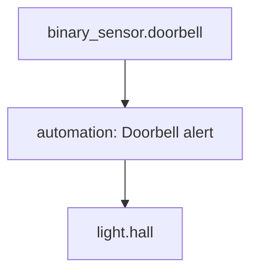

korzystam z codegraph w homeassistant, ale widocznie nie ma on obsługi specyficznych plików dla homeassiistant. czy możesz zweryfikować czy istnieje jakieś narzędzie tego typu, alvo czy ktoś pracuje nad rozwinięciem extension do tego albo oszacować stopień złożoności dopisania takiego narzędzia do homeassistant?

Tak — problem jest dokładnie taki, jak podejrzewasz: **CodeGraph widzi pliki, ale nie rozumie semantyki Home Assistanta**. Dla HA zwykły graph kodu jest za płytki, bo najważniejsze zależności nie są w funkcjach/klasach, tylko w YAML-ach, encjach, `service/action`, `target`, `device_id`, `area_id`, Jinja template, `!include`, pakietach, automatyzacjach, scenach, helperach i czasem w `.storage`.

### Co znalazłem

**1. CodeGraph jako narzędzie ogólne nie jest gotowe pod Home Assistant.**
Klasyczny `xnuinside/codegraph` jest statycznym analizatorem Pythona: moduły, klasy, funkcje, zależności — bez wykonywania kodu. To tłumaczy, czemu w Twoim repo Python został zindeksowany, ale logika HA z YAML-i jest tylko częściowo użyteczna. ([GitHub][1])

**2. Nowszy `colbymchenry/codegraph` miał świeży issue dotyczący YAML.**
Zgłoszenie „YAML files cannot be read” istnieje i zostało zamknięte przez #357. W opisie wyszukiwarki pojawia się ważna informacja: problem miał dotyczyć raportowania, nie samego wykrywania YAML — `.yml/.yaml` są wykrywane i przechowywane, ale to nadal nie oznacza pełnego rozumienia Home Assistanta. ([GitHub][2])

**3. Istnieje narzędzie bardzo bliskie temu, czego chcesz: `EntityMap`.**
To świeża custom integration do Home Assistanta: buduje graf zależności urządzeń, encji, automatyzacji, skryptów, scen, helperów i grup; ma interaktywny graf, impact analysis, wykrywanie kruchych zależności, brakujących encji, `device_id`, stale references itd. Brzmi dokładnie jak „CodeGraph, ale dla HA”. Repo jest nowe — release v1.0.0 z marca 2026 i praktycznie brak społecznego track recordu, więc traktowałbym to jako obiecujący projekt do testów, nie jako pewny fundament produkcyjny. ([GitHub][3])

**4. Społeczność HA pytała o takie narzędzie.**
W marcu 2025 na forum HA ktoś pytał dokładnie o mapowanie zależności automatyzacji: helpery, encje itd. To sugeruje, że luka była realna i nie było wtedy oczywistego standardowego rozwiązania. ([Home Assistant Community][4])

**5. VS Code Home Assistant Config Helper pomaga, ale to nie jest graf zależności.**
Ma autouzupełnianie encji, walidację schematów, rozumienie `!include`, przechodzenie do definicji include’ów i renderowanie template’ów przez API HA. Ale nawet w jego TODO widać „Go to Definition for entities, scripts and automations”, czyli pełna nawigacja semantyczna po HA nie jest domknięta. ([Visual Studio Marketplace][5])

**6. Jest też kierunek MCP/AI, np. `ha-mcp-file-server`.**
Ten projekt deklaruje scenariusze typu: znajdź wszystkie miejsca użycia encji, pokaż co się zepsuje po rename, wykryj osierocone encje, zmapuj zależności oświetlenia. To bardziej narzędzie dla agenta AI niż gotowy wizualny graf, ale pasuje do Twojego stylu pracy z agentami. ([GitHub][6])

---

## Moja ocena: co bym zrobił u Ciebie

Najpierw przetestowałbym **EntityMap**. Ono jest najbliżej celu i działa wewnątrz HA, więc ma dostęp do rejestrów encji, urządzeń, obszarów i realnego stanu systemu. To daje mu przewagę nad zwykłym CodeGraph, który widzi tylko pliki.

Natomiast nie zakładałbym, że EntityMap rozwiąże wszystko. W Home Assistant najtrudniejsze są:

```yaml
{{ states('sensor.xxx') }}
{{ expand('group.xxx') }}
{{ state_attr('climate.xxx', 'temperature') }}
service: light.turn_on
target:
  area_id: salon
choose:
  - conditions: ...
    sequence:
      - action: script.some_script
```

oraz dynamiczne rzeczy typu:

```yaml
{{ 'light.' ~ room ~ '_main' }}
```

Tego żaden prosty parser nie rozpozna w 100%. Można to oznaczać jako „dynamic dependency / uncertain dependency”, ale nie zawsze da się wyprowadzić twardą krawędź grafu.

---

## Czy dopisanie takiego narzędzia jest trudne?

Zależy, jaki poziom chcesz osiągnąć.

### Poziom 1: szybki skaner YAML + raport zależności

**Złożoność: niska / średnia.**
Realnie: 2–4 dni robocze dla sensownego MVP.

Działałoby tak:

```text
czytaj YAML-e
→ obsłuż !include / !include_dir_merge_list / !include_dir_named
→ znajdź encje regexem: domain.object_id
→ znajdź service/action
→ znajdź target.entity_id / device_id / area_id
→ znajdź script.xxx / scene.xxx / automation.xxx
→ zbuduj SQLite/JSON
→ wypluj HTML / Mermaid / Graphviz / CSV
```

Dla Twojego repo, gdzie masz 176 plików i głównie YAML/bash, to już dałoby sporą wartość. Nie będzie idealne, ale do pytań typu „gdzie używam `hiki vision doorbell`?” albo „co dotknie zmiana encji?” wystarczy.

### Poziom 2: używalny lokalny graph dla agenta

**Złożoność: średnia.**
Realnie: 1–2 tygodnie.

Dodałbym:

```text
- indeks SQLite + FTS5
- graf: nodes / edges / files / line ranges
- narzędzia MCP:
  - find_entity_references
  - get_dependencies
  - get_dependents
  - explain_automation
  - impact_analysis
  - list_orphans
  - render_graph_subtree
- parser Jinja dla states(), is_state(), state_attr(), expand()
- ranking pewności zależności: exact / inferred / dynamic
```

To byłoby najbardziej użyteczne dla Ciebie, bo agent w OpenCode/Codex/Claude mógłby pytać graf zamiast robić `grep`.

### Poziom 3: pełna integracja Home Assistant

**Złożoność: średnia / wysoka.**
Realnie: 3–6 tygodni na solidną wersję.

Potrzebne elementy:

```text
custom_components/ha_dependency_graph/
  __init__.py
  config_flow.py
  services.yaml
  websocket_api.py
  sensor.py
  diagnostics.py
  panel frontend
```

Funkcje:

```text
- scan config
- scan live entity/device/area registries
- analyze_impact(entity_id/device_id/area_id)
- detect stale references
- detect fragile device_id coupling
- show graph in panel
- expose services to HA
- export JSON for agentów
```

To zaczyna przypominać EntityMap.

### Poziom 4: produkt klasy „HA CodeGraph”

**Złożoność: wysoka.**
Realnie: 2–3 miesiące, jeśli ma być dobrze.

Bo trzeba obsłużyć:

```text
- automatyzacje z UI i YAML
- skrypty, sceny, blueprints
- packages
- dashboards Lovelace
- template sensors
- helpers
- groups
- labels/floors/areas
- Node-RED, jeśli używasz
- dynamiczne Jinja
- migracje nazw encji
- testy na wielu stylach konfiguracji
```

---

## Najlepszy praktyczny stack

Dla Ciebie widzę trzy sensowne ścieżki.

### Ścieżka A — szybka i pragmatyczna

Zainstaluj/przetestuj **EntityMap** jako custom integration.
Jeśli działa dobrze, używaj jako warstwy wizualnej, a CodeGraph zostaw do Pythona/custom components.

To jest najmniej pracy i największa szansa na szybki efekt.

### Ścieżka B — własny lekki skaner pod agentów

Napisać mały projekt:

```text
ha-graph/
  scanner.py
  yaml_loader.py
  jinja_refs.py
  graph_store.py
  mcp_server.py
  graph_export.py
```

Wyjścia:

```text
ha-graph scan /config
ha-graph entity sensor.foo
ha-graph impact light.salon
ha-graph graph --around automation.noc
```

To jest moim zdaniem najlepszy kierunek, jeśli chcesz mieć narzędzie dokładnie pod swoje repo i agentów.

### Ścieżka C — fork/extension do CodeGraph

Możliwe, ale mniej naturalne.

Dlaczego? Bo CodeGraph jest zbudowany wokół „symboli kodu”: funkcje, klasy, importy, call graph. Home Assistant potrzebuje innego modelu:

```text
Automation --triggers_on--> Entity
Automation --calls_service--> DomainService
Automation --targets--> Entity/Area/Device
Script --calls--> Script
TemplateSensor --reads--> Entity
DashboardCard --displays--> Entity
Device --has--> Entity
Entity --belongs_to--> Area
```

To nie jest klasyczny code graph. To raczej **domain graph / configuration graph**.

---

## Co powinno być parserowane w Home Assistant

Minimalny zestaw:

```text
automation:
  - triggers
  - conditions
  - actions
  - choose
  - repeat
  - wait_template
  - variables

script:
  - sequence
  - calls to other scripts
  - service/action targets

scene:
  - affected entities

template:
  - states()
  - is_state()
  - state_attr()
  - expand()
  - nowy syntax trigger-based template sensors

configuration.yaml:
  - includes
  - packages
  - template sensors
  - command_line
  - rest
  - mqtt
  - shell_command
  - input_boolean/input_select/input_number/etc.

dashboards:
  - entities displayed in Lovelace cards

.storage:
  - UI-created automations
  - dashboards
  - helpers
```

Największa pułapka: **same YAML-e nie wystarczą**, bo dużo konfiguracji HA żyje w `.storage` albo w rejestrach. Dlatego narzędzie idealne powinno łączyć:

```text
statyczny scan plików
+ live API Home Assistant
+ entity/device/area registries
+ opcjonalnie logbook/history/state snapshot
```

---

## Moja rekomendacja końcowa

Nie próbowałbym „nauczyć CodeGraph Home Assistanta” jako pierwszego kroku. To byłaby walka z modelem narzędzia.

Najlepsza kolejność:

1. **Przetestuj EntityMap** — wygląda jak najbliższe gotowe rozwiązanie.
2. Równolegle zostaw CodeGraph do Pythona/custom components.
3. Jeśli EntityMap jest zbyt płytkie albo niedojrzałe, napisz/każ agentowi napisać **mały `ha-graph-mcp`**: skaner YAML + `.storage` + HA WebSocket API + SQLite/FTS5 + MCP.
4. Dopiero potem myśl o pełnej integracji HA albo forku.

Dla Twojego repo MVP naprawdę nie jest duże. Największa wartość nie będzie w pięknym grafie, tylko w konkretnych komendach dla agenta:

```text
find all references to binary_sensor.hiki_vision_doorbell
show impact of renaming switch.doorbell_chime
list automations that control light.salon
find stale entity references
find scripts not called anywhere
show dependency chain for alarm automation
```

To jest do zrobienia szybko i da Ci więcej niż ogólny CodeGraph, który indeksuje YAML jako pliki, ale nie rozumie, co te YAML-e znaczą w Home Assistant.

[1]: https://github.com/xnuinside/codegraph "GitHub - xnuinside/codegraph: Static Python dependency graph with interactive HTML visualization, massive object detection, and unlinked module analysis (no code execution). · GitHub"
[2]: https://github.com/colbymchenry/codegraph/issues/317 "yam file cannot be read. · Issue #317 · colbymchenry/codegraph · GitHub"
[3]: https://github.com/polprog-tech/EntityMap "GitHub - POLPROG-TECH/EntityMap: Visual dependency graph and impact analysis for Home Assistant - understand how devices, entities, automations, scripts, scenes and helpers are connected. · GitHub"
[4]: https://community.home-assistant.io/t/tool-to-map-show-automation-dependencies/870832 "Tool to map / show Automation Dependencies? - Configuration - Home Assistant Community"
[5]: https://marketplace.visualstudio.com/items?itemName=keesschollaart.vscode-home-assistant "
        Home Assistant Config Helper - Visual Studio Marketplace
    "
[6]: https://github.com/renehagen/ha-mcp-file-server "GitHub - renehagen/ha-mcp-file-server · GitHub"


zapoznaj się z moim repozytorium https://github.com/paulomac1000/ha-mcp-readonly i zastanów się, czy tego typu elementy można do niego wdrożyć

Tak. **To repo jest nawet lepszym miejscem na taki “HA CodeGraph” niż klasyczny CodeGraph**, bo już masz dostęp do dwóch światów naraz: plików `/config` oraz runtime danych z Home Assistanta przez API/rejestry. Zwykły CodeGraph widzi głównie pliki i symbole kodu, a Twoje repo już rozumie encje, automatyzacje, dashboardy, rejestry, logi i kontekst HA.

Najważniejsze: **nie budowałbym tego jako osobnego narzędzia obok `ha-mcp-readonly`, tylko jako warstwę grafową wewnątrz niego**.

## Co już masz i dlaczego to jest dobry fundament

Twoje README mówi, że projekt jest read-only MCP dla Home Assistanta, z obserwowalnością encji, automatyzacji, skryptów, urządzeń, logów i diagnostyki, oraz generowaniem statycznych snapshotów kontekstu dla RAG/AI tools. To dokładnie ten sam kierunek, tylko jeszcze bez pełnego “persistent dependency graph”. ([GitHub][1])

Masz już narzędzia typu:

```text
get_entity_dependencies
get_entity_consumers
entity_get_context_tree
search_in_config
get_automation_code
get_lovelace_config
search_lovelace_config
search_registries_batch
```

README pokazuje też, że obecna wersja ma 122–134 narzędzia, w tym kategorię `Context` z `entity_get_context_tree`, `get_entity_dependencies`, `get_entity_consumers`, kategorię `Config`, `Storage`, `Lovelace`, `Composite` i `Dev tools`. ([GitHub][1])

To oznacza, że nie zaczynasz od zera. Masz już 70–80% surowców.

## Najważniejsza obserwacja z kodu

Obecne `tools/entity_dependencies.py` robi dependency lookup dość prosto: osobno szuka encji w `automations.yaml`, `scripts.yaml`, dashboardach Lovelace i template entries. W automatyzacjach idzie głównie przez rekurencyjne `str`/substring matching i zwraca pierwszy znaleziony path.  Potem `get_entity_dependencies` skleja wynik jako `used_in` plus `depends_on` z entity/device/config-entry registry. 

To działa jako szybki lookup, ale **to jeszcze nie jest graf**. Brakuje mu wspólnego indeksu, relacji typu `reads`, `controls`, `calls_service`, `displayed_on`, `defined_in`, `belongs_to_device`, `belongs_to_area`, confidence score i lokalizacji w pliku.

Co ciekawe, w `context_generator` masz już mocniejszą logikę niż w `entity_dependencies.py`. `extract_entities_from_template()` rozpoznaje między innymi `states('sensor.x')`, `is_state()`, `state_attr()` i `states.sensor.x`, a `extract_entities_from_data()` rekurencyjnie wyciąga encje z danych i template’ów.  Masz też ekstrakcję triggerów, services i controlled entities.  

Najbliżej “grafu” jest `AutomationAnalyzer`: buduje mapy `entity_triggered_by`, `entity_used_in`, `entity_controlled_by`, wykrywa ghost entities i potencjalne konflikty.  W analizie automatyzacji rejestruje osobno encje z triggerów, conditions, actions, controlled entities i services. 

Czyli: **masz analizator zależności, ale nie masz jeszcze uniwersalnego grafu zależności jako pierwszorzędnego modelu danych**.

## Co bym wdrożył

Wdrożyłbym nowy moduł, np.:

```text
tools/graph.py
tools/graph_index.py
tools/graph_extractors.py
tools/graph_models.py
tools/graph_store.py
```

albo bardziej elegancko:

```text
ha_graph/
  models.py
  scanner.py
  extractors/
    yaml_extractor.py
    automation_extractor.py
    script_extractor.py
    scene_extractor.py
    template_extractor.py
    lovelace_extractor.py
    registry_extractor.py
    storage_extractor.py
  store.py
  queries.py
  export.py
tools/graph_tools.py
```

### Model grafu

Minimalny model:

```python
Node:
  id: str
  type: entity | automation | script | scene | dashboard | device | area | integration | service | file | template | blueprint
  name: str | None
  metadata: dict

Edge:
  source: str
  target: str
  relation: reads | controls | triggers_on | calls_service | calls_script | activates_scene | displayed_on | belongs_to_device | belongs_to_area | defined_in | includes | uses_blueprint
  confidence: exact | inferred | dynamic | weak
  file_path: str | None
  path: str | None
  line: int | None
  evidence: str | None
```

To jest ważne: w HA nie wystarczy “encja występuje w pliku”. Musisz wiedzieć **jak** występuje.

Przykład:

```yaml
trigger:
  - platform: state
    entity_id: binary_sensor.door
action:
  - action: light.turn_on
    target:
      entity_id: light.hall
```

Graf powinien dać:

```text
automation.front_door_light --triggers_on--> binary_sensor.door
automation.front_door_light --controls--> light.hall
automation.front_door_light --calls_service--> light.turn_on
automation.front_door_light --defined_in--> automations.yaml
```

To jest dużo bardziej użyteczne dla agenta niż samo “znalazłem string”.

## Narzędzia MCP, które warto dodać

Dodałbym takie read-only tools:

```text
graph_build_index()
```

Buduje indeks zależności z `/config`, `.storage`, rejestrów i opcjonalnie API HA.

```text
graph_find_references(entity_id)
```

Zwraca wszystkie wystąpienia encji z typem relacji: trigger, condition, action, dashboard, template, script, scene.

```text
graph_entity_impact(entity_id)
```

Pokazuje “co się zepsuje, jeśli zmienię/usunę tę encję”.

```text
graph_get_neighbors(node_id, depth=1)
```

Pokazuje lokalny podgraf wokół encji/automatyzacji/skryptu.

```text
graph_explain_path(source, target)
```

Przykład: “dlaczego `binary_sensor.doorbell` wpływa na `light.korytarz`?”

```text
graph_detect_orphans()
```

Encje istniejące, ale nieużywane w automatyzacjach/skryptach/dashboardach.

```text
graph_detect_ghost_references()
```

Encje używane w YAML/dashboardach, ale nieistniejące w registry/states.

```text
graph_export_mermaid(node_id=None, depth=2)
```

Dla agenta i dokumentacji.

```text
graph_export_json()
```

Dla RAG, CodeGraph-like UI albo zewnętrznej wizualizacji.

## Co trzeba poprawić względem obecnego kodu

### 1. Nie duplikować logiki

Teraz `entity_dependencies.py` ma własny prosty parser, a `context_generator/utils.py` ma lepsze ekstraktory. To trzeba scalić. `get_entity_dependencies` powinien korzystać z jednego centralnego `GraphIndex`, a nie z osobnego substring search.

Obecnie `_find_entity_in_automations()` przeszukuje tylko `automations.yaml`.  To jest ograniczenie, bo HA może mieć automatyzacje w packages, include’ach, `automations/*.yaml`, `!include_dir_merge_list`, a część konfiguracji może siedzieć w `.storage`.

### 2. Dodać resolver include’ów

Masz loader HA tagów, który obsługuje `!include`, `!secret`, `!input`, `!include_dir_*` jako specjalne stringi.  To dobre dla bezpiecznego czytania, ale graf potrzebuje drugiego kroku: **rozpoznaj include i zeskanuj wskazany plik/katalog**.

Czyli nie tyle “wykonuj HA config”, ile:

```text
configuration.yaml
  !include automations.yaml
  !include_dir_merge_list automations/
  !include_dir_named scripts/
  packages: !include_dir_named packages/
```

i z tego buduj edge:

```text
configuration.yaml --includes--> automations.yaml
configuration.yaml --includes--> packages/heating.yaml
```

### 3. Dodać lokalizację w pliku

Dla agenta samo “znaleziono w automatyzacji X” jest mniej użyteczne niż:

```json
{
  "file": "automations/doorbell.yaml",
  "line": 42,
  "path": "action[1].target.entity_id",
  "relation": "controls",
  "evidence": "target.entity_id: light.hall"
}
```

PyYAML standardowo gubi numery linii. Da się to obejść przez custom loader dodający `__line__`, albo przejść na `ruamel.yaml`, który lepiej zachowuje strukturę i lokalizację. To jest jedna z większych zmian, ale mocno zwiększa użyteczność.

### 4. Rozdzielić “reads” od “controls”

Obecnie ekstrakcja controlled entities istnieje w `extract_controlled_entities()`.  To trzeba wykorzystać jako centralną regułę grafu.

Różnica jest krytyczna:

```text
automation A reads sensor.temperature
automation A controls climate.living_room
```

To zupełnie inna relacja niż:

```text
automation A controls sensor.temperature
```

Agent musi to wiedzieć, bo inaczej będzie źle oceniać impact.

### 5. Dodać confidence score

Dla HA to konieczne.

Przykład exact:

```yaml
entity_id: light.salon
```

Przykład inferred:

```jinja
{{ states('sensor.temperature') }}
```

Przykład weak:

```text
tekst zawiera "sensor.temperature"
```

Przykład dynamic:

```jinja
{{ states('sensor.' ~ room ~ '_temperature') }}
```

Dla dynamicznych rzeczy nie udawaj precyzji. Lepiej zwrócić:

```json
{
  "relation": "reads",
  "target": null,
  "confidence": "dynamic",
  "pattern": "sensor.*_temperature",
  "evidence": "{{ states('sensor.' ~ room ~ '_temperature') }}"
}
```

## Czy to pasuje do architektury repo?

Tak, bardzo.

Masz centralny `server.py`, który rejestruje moduły narzędzi. Dodanie `register_graph_tools(mcp, HA_CONFIG_PATH, HA_URL, HA_TOKEN)` pasuje do obecnego stylu rejestracji. `server.py` już rejestruje `entity_dependencies`, `entity_context`, `storage`, `config`, `automation`, `lovelace`, `batch`, `composite` itd. 

Masz też REST API na porcie 9093 i context generator. README mówi, że REST API pozwala listować tools, wywoływać je przez HTTP i pobrać OpenAPI schema. ([GitHub][1]) To oznacza, że graf możesz wystawić zarówno jako MCP tool, jak i REST endpoint.

Najlepszy wariant:

```text
MCP tools:
  graph_find_references
  graph_entity_impact
  graph_get_neighbors
  graph_export_mermaid

REST:
  GET /api/graph
  GET /api/graph/node/{id}
  GET /api/graph/impact/{entity_id}
  GET /api/graph/export/mermaid
```

## Co bym zrobił jako pierwszy etap

Nie zaczynałbym od pięknej wizualizacji. Zacząłbym od **silnika grafu i narzędzi tekstowych dla agenta**.

### Etap 1 — GraphIndex MVP

Czas: realnie 3–5 dni.

Zakres:

```text
- skan automations.yaml
- skan scripts.yaml
- skan scenes.yaml
- skan configuration.yaml
- skan .storage/lovelace*
- entity registry
- device registry
- area registry
- config entries
- extract: entity_id, service/action, target.entity_id, templates
- edges: reads, controls, triggers_on, calls_service, displayed_on, belongs_to_device, belongs_to_area, from_integration
- JSON export
- 4 MCP tools:
  graph_find_references
  graph_entity_impact
  graph_get_neighbors
  graph_detect_ghost_references
```

### Etap 2 — resolver include’ów i packages

Czas: 3–7 dni.

Zakres:

```text
- !include
- !include_dir_list
- !include_dir_named
- !include_dir_merge_list
- !include_dir_merge_named
- packages
- line/path tracking
- de-duplication
- confidence score
```

### Etap 3 — jakość HA

Czas: 1–2 tygodnie.

Zakres:

```text
- blueprint instances
- UI-created automations/scripts jeśli są w .storage
- helpers
- template sensors
- MQTT/rest/command_line/shell_command
- dashboard custom cards
- area_id/device_id target resolution
- script-to-script calls
- scene activation impact
```

### Etap 4 — wizualizacja

Czas: 1–2 tygodnie.

Zakres:

```text
- Mermaid/DOT export
- HTML graph
- filtrowanie po area/integration/domain
- graph around entity
- graph around automation
- conflict map
```

## Największa trudność

Najtrudniejsze nie jest MCP. MCP masz już ogarnięte.

Najtrudniejsze są trzy rzeczy:

1. **Wszystkie style konfiguracji Home Assistanta** — YAML, packages, include directories, UI storage, template helpers.
2. **Dynamiczne Jinja** — część zależności da się tylko oszacować.
3. **Semantyka relacji** — encja w triggerze, condition, target i dashboardzie oznacza coś innego.

Dlatego trzeba robić graf z `relation` i `confidence`, a nie prostą mapę “encja → pliki”.

## Czy warto integrować z CodeGraph?

Raczej nie jako zależność główną.

Twoje repo powinno robić **Home Assistant domain graph**, a nie klasyczny code graph. CodeGraph może być inspiracją dla formatu eksportu, ale nie dla modelu. HA to nie Python call graph. Tu podstawowe relacje to:

```text
automation --triggers_on--> entity
automation --reads--> entity
automation --controls--> entity
automation --calls_service--> service
script --controls--> entity
dashboard --displays--> entity
entity --belongs_to_device--> device
device --belongs_to_area--> area
entity --from_integration--> config_entry/integration
file --includes--> file
template --reads--> entity
```

To jest osobny model.

## Moja rekomendacja

**Tak, wdrażaj to do `ha-mcp-readonly`.**
Ale nie jako “extension do CodeGraph”, tylko jako nową warstwę:

```text
HA Dependency Graph / HA Semantic Graph
```

W praktyce zrobiłbym to tak:

```text
1. Wyciągnąć obecne ekstraktory z context_generator/utils.py do wspólnego modułu.
2. Przepisać entity_dependencies.py, żeby używał GraphIndex.
3. Dodać GraphIndex budowany on-demand i cache’owany np. 5 minut.
4. Dodać narzędzia graph_*.
5. Dodać eksport Mermaid/JSON.
6. Dopiero potem dodać wizualizację.
```

Największy zysk dla Ciebie będzie z komend typu:

```text
graph_entity_impact("binary_sensor.hikvision_doorbell")
graph_find_references("switch.doorbell_chime")
graph_get_neighbors("automation.doorbell_alert", depth=2)
graph_detect_ghost_references()
graph_detect_orphans()
graph_export_mermaid("binary_sensor.hikvision_doorbell")
```

To repo jest do tego naturalnym miejscem. Masz już read-only bezpieczeństwo, HA API, dostęp do `/config`, `.storage`, rejestrów, context generator i MCP/REST warstwę. Brakuje tylko jednej rzeczy: **zrobienia z obecnych rozproszonych analizatorów jednego spójnego indeksu grafowego**.

[1]: https://github.com/paulomac1000/ha-mcp-readonly "GitHub - paulomac1000/ha-mcp-readonly: Homeassistant MCP server with readonly functions · GitHub"


pogłęb analizę i przygotuj całą instrukcję co i jak wdrożyć w tym projekcie

Tak. Po głębszym spojrzeniu: **to powinno wejść do `ha-mcp-readonly` jako osobna warstwa “HA Semantic Graph / HA Dependency Graph”, a nie jako dopisek do obecnego `get_entity_dependencies`**. Obecne narzędzia już robią dużo pojedynczych analiz, ale brakuje jednego wspólnego indeksu grafowego, z którego korzystałyby wszystkie narzędzia zależnościowe.

Poniżej masz kompletną instrukcję wdrożenia.

---

# 1. Cel wdrożenia

Chcesz dodać do projektu mechanizm, który odpowiada na pytania typu:

```text
Co używa encji binary_sensor.hikvision_doorbell?
Co się zepsuje po zmianie nazwy encji?
Które automatyzacje sterują light.salon?
Które encje są osierocone?
Które encje są używane w YAML/dashboardach, ale nie istnieją?
Jaka jest ścieżka zależności: czujnik → automatyzacja → skrypt → encja?
Pokaż lokalny graf wokół tej automatyzacji.
```

Obecnie `entity_dependencies.py` robi to częściowo, ale prostą metodą: szuka encji w `automations.yaml`, `scripts.yaml`, template’ach i dashboardach, a potem skleja wynik w `used_in`/`depends_on`. W automatyzacjach działa to przez rekurencyjne przeszukiwanie obiektu i substring matching, bez pełnego modelu relacji.  Wynik `get_entity_dependencies` jest użyteczny, ale nadal płaski: `automations`, `scripts`, `templates`, `dashboards`, `depends_on`. 

Nowy cel:

```text
Zamiast:
entity_id → lista miejsc, gdzie występuje string

Ma być:
graf semantyczny HA:
automation --triggers_on--> entity
automation --reads--> entity
automation --controls--> entity
automation --calls_service--> service
script --calls_script--> script
script --controls--> entity
dashboard --displays--> entity
entity --belongs_to_device--> device
device --belongs_to_area--> area
entity --from_integration--> integration
file --includes--> file
```

---

# 2. Dlaczego to pasuje do obecnego repo

Projekt już ma dobrą architekturę pod takie rozszerzenie.

W `server.py` narzędzia są rejestrowane modułowo: `states`, `automations`, `scripts`, `scenes`, `config`, `storage`, `diagnostics`, `entity_dependencies`, `entity_context`, `integrations`, `batch_operations` itd.  Same rejestracje są wykonywane jawnie w jednym miejscu, więc dodanie `register_graph_tools(...)` będzie naturalne. 

Masz też read-only model dostępu do filesystemu. `filesystem_explorer.py` ogranicza dostęp do `/config`, blokuje traversal i trzyma limit rozmiaru/depth.  Globalny security context jest ustawiony tylko na `/config`.  To jest ważne, bo graf też powinien być wyłącznie obserwacyjny.

Masz już gotowe ekstraktory, tylko są rozproszone. `context_generator/utils.py` umie wyciągać encje z Jinja: `states('sensor.x')`, `is_state()`, `state_attr()`, `states.sensor.x` oraz fallback regexem.  `extract_entities_from_data()` rekurencyjnie idzie po strukturach YAML/JSON i wyciąga encje także z template’ów.  Masz też `extract_trigger_info`, `extract_services` i `extract_controlled_entities`, czyli najważniejsze klocki semantycznego grafu.  

Dodatkowo `AutomationAnalyzer` już ma zaczątek grafu: `entity_triggered_by`, `entity_used_in`, `entity_controlled_by`, `ghost_entities`, `entity_conflicts`.  W analizie automatyzacji rozdziela trigger entities, condition entities, action entities, controlled entities i services. 

Czyli nie trzeba wymyślać wszystkiego od zera. Trzeba to uporządkować w jeden wspólny indeks.

---

# 3. Proponowana architektura

Dodaj nowy pakiet:

```text
ha_graph/
  __init__.py
  models.py
  extractors.py
  scanner.py
  store.py
  queries.py
  export.py
  cache.py

tools/
  graph_tools.py

tests/
  test_graph_models.py
  test_graph_extractors.py
  test_graph_scanner.py
  test_graph_queries.py
  test_graph_tools.py
```

Alternatywnie, jeśli nie chcesz nowego pakietu na root level, możesz dać to pod:

```text
tools/graph/
  models.py
  extractors.py
  scanner.py
  store.py
  queries.py
  export.py
```

Ja wybrałbym **`ha_graph/`**, bo to będzie warstwa domenowa, a `tools/graph_tools.py` tylko adapter MCP.

---

# 4. Model danych

## 4.1. Node

W `ha_graph/models.py`:

```python
from __future__ import annotations

from dataclasses import dataclass, field
from typing import Any, Literal


NodeType = Literal[
    "entity",
    "automation",
    "script",
    "scene",
    "dashboard",
    "device",
    "area",
    "integration",
    "service",
    "file",
    "template",
    "blueprint",
    "helper",
    "unknown",
]


@dataclass(frozen=True)
class GraphNode:
    id: str
    type: NodeType
    name: str | None = None
    metadata: dict[str, Any] = field(default_factory=dict)
```

Przykłady `id`:

```text
entity:binary_sensor.hikvision_doorbell
automation:doorbell_alert
script:notify_all
scene:evening
dashboard:lovelace.main
device:abc123
area:salon
integration:hikvision
service:light.turn_on
file:automations.yaml
```

Nie dawaj gołych `sensor.foo` jako globalnych ID, bo potem będzie konflikt między encją, service, plikiem itd. Używaj prefiksów.

---

## 4.2. Edge

```python
RelationType = Literal[
    "triggers_on",
    "reads",
    "controls",
    "calls_service",
    "calls_script",
    "activates_scene",
    "displays",
    "belongs_to_device",
    "belongs_to_area",
    "from_integration",
    "defined_in",
    "includes",
    "uses_blueprint",
    "has_entity",
    "via_device",
    "unknown_reference",
]


Confidence = Literal[
    "exact",
    "inferred",
    "dynamic",
    "weak",
]


@dataclass(frozen=True)
class GraphEdge:
    source: str
    target: str | None
    relation: RelationType
    confidence: Confidence = "exact"
    file_path: str | None = None
    object_path: str | None = None
    line: int | None = None
    evidence: str | None = None
    metadata: dict[str, Any] = field(default_factory=dict)
```

Kluczowe pola:

```text
source      kto używa
target      co jest używane
relation    jak jest używane
confidence  jak pewne jest wykrycie
file_path   gdzie znaleziono
object_path ścieżka w YAML/JSON, np. action[0].target.entity_id
line        docelowo numer linii
evidence    krótki fragment
```

---

## 4.3. GraphIndex

```python
@dataclass
class GraphIndex:
    nodes: dict[str, GraphNode] = field(default_factory=dict)
    edges: list[GraphEdge] = field(default_factory=list)
    built_at: float | None = None
    stats: dict[str, Any] = field(default_factory=dict)

    def add_node(self, node: GraphNode) -> None:
        self.nodes[node.id] = node

    def add_edge(self, edge: GraphEdge) -> None:
        self.edges.append(edge)

    def outgoing(self, node_id: str) -> list[GraphEdge]:
        return [e for e in self.edges if e.source == node_id]

    def incoming(self, node_id: str) -> list[GraphEdge]:
        return [e for e in self.edges if e.target == node_id]
```

Na start nie potrzebujesz NetworkX. Lista edge’ów + indeksy wystarczą. NetworkX można dodać później, jeśli będziesz robić ścieżki i centrality.

---

# 5. Najważniejsze relacje

## Encje w automatyzacjach

Przykład:

```yaml
trigger:
  - platform: state
    entity_id: binary_sensor.doorbell

condition:
  - condition: state
    entity_id: input_boolean.notifications_enabled
    state: "on"

action:
  - action: light.turn_on
    target:
      entity_id: light.hall
```

Relacje:

```text
automation:doorbell_alert --triggers_on--> entity:binary_sensor.doorbell
automation:doorbell_alert --reads--> entity:input_boolean.notifications_enabled
automation:doorbell_alert --controls--> entity:light.hall
automation:doorbell_alert --calls_service--> service:light.turn_on
automation:doorbell_alert --defined_in--> file:automations.yaml
```

## Encje w dashboardach

```text
dashboard:lovelace.main --displays--> entity:light.hall
dashboard:lovelace.main --defined_in--> file:.storage/lovelace
```

## Registry

```text
entity:light.hall --belongs_to_device--> device:abc123
device:abc123 --belongs_to_area--> area:hall
entity:light.hall --from_integration--> integration:zigbee2mqtt
```

Obecne `_get_entity_dependencies_info()` już pobiera `platform`, `config_entry_id`, `device_id`, integration i device name z registry.  To trzeba przenieść do `registry_extractor`.

---

# 6. Co przenieść z obecnego kodu

## Do `ha_graph/extractors.py`

Przenieś lub zaimportuj centralnie:

```text
extract_entities_from_template
extract_entities_from_data
extract_trigger_info
extract_services
extract_controlled_entities
```

One teraz siedzą w `context_generator/utils.py`. Niech `context_generator` i nowe `graph_tools` używają tego samego kodu. Nie duplikuj.

Docelowo:

```text
ha_graph/extractors.py
context_generator/utils.py -> importuje z ha_graph.extractors
tools/entity_dependencies.py -> używa GraphIndex
```

To zmniejszy rozjazdy. Teraz `entity_dependencies.py` ma własną prostszą logikę, a `context_generator` ma bogatszą. To jest źródło przyszłych bugów.

---

# 7. Skaner grafu

Dodaj `ha_graph/scanner.py`.

## 7.1. Publiczne API

```python
from pathlib import Path

from ha_graph.models import GraphIndex


def build_graph_index(
    config_path: str,
    ha_url: str | None = None,
    ha_token: str | None = None,
) -> GraphIndex:
    index = GraphIndex()
    scanner = HomeAssistantGraphScanner(config_path, ha_url, ha_token)
    scanner.scan(index)
    return index
```

## 7.2. Klasa skanera

```python
class HomeAssistantGraphScanner:
    def __init__(self, config_path: str, ha_url: str | None, ha_token: str | None):
        self.config_path = Path(config_path)
        self.ha_url = ha_url
        self.ha_token = ha_token

    def scan(self, index: GraphIndex) -> None:
        self.scan_registries(index)
        self.scan_automations(index)
        self.scan_scripts(index)
        self.scan_scenes(index)
        self.scan_dashboards(index)
        self.scan_configuration(index)
        self.scan_blueprints(index)
        self.compute_stats(index)
```

---

# 8. Registry extractor

Źródła:

```text
.storage/core.entity_registry
.storage/core.device_registry
.storage/core.area_registry
.storage/core.config_entries
```

Masz już `load_registry(...)` w kilku miejscach. Użyj istniejącego helpera z `tools.utils` albo ujednolić go później.

Dla każdej encji:

```python
entity_node = GraphNode(
    id=f"entity:{entity_id}",
    type="entity",
    name=entity.get("name") or entity.get("original_name") or entity_id,
    metadata={
        "platform": entity.get("platform"),
        "device_id": entity.get("device_id"),
        "config_entry_id": entity.get("config_entry_id"),
        "disabled_by": entity.get("disabled_by"),
        "hidden_by": entity.get("hidden_by"),
    },
)
```

Relacje:

```text
entity -> device
entity -> integration/config_entry
device -> area
device -> via_device
```

Uwaga: `via_device` jest ważne przy Zigbee/Z-Wave. Obecnie `_get_entity_dependencies_info()` już czyta `via_device_id`. 

---

# 9. Automation extractor

Najpierw obsłuż obecny podstawowy przypadek:

```text
/config/automations.yaml
```

Potem dopiero include’y i packages.

## Algorytm

Dla każdej automatyzacji:

```python
auto_id = auto.get("id") or slugify(auto.get("alias", "unknown"))
alias = auto.get("alias", auto_id)
node_id = f"automation:{auto_id}"
```

Dodaj node:

```python
GraphNode(
    id=node_id,
    type="automation",
    name=alias,
    metadata={
        "mode": auto.get("mode", "single"),
        "id": auto_id,
        "alias": alias,
    },
)
```

Dodaj:

```text
automation --defined_in--> file:automations.yaml
```

### Triggery

Użyj `extract_trigger_info`.

```python
trigger_entities, trigger_platforms = extract_trigger_info(auto.get("trigger", []))
```

Dla każdej encji:

```text
automation --triggers_on--> entity
```

### Conditions

```python
condition_entities = extract_entities_from_data(auto.get("condition", []))
```

Dla każdej:

```text
automation --reads--> entity
```

### Actions

```python
actions = auto.get("action", [])
action_entities = extract_entities_from_data(actions)
controlled = extract_controlled_entities(actions)
services = extract_services(actions)
```

Dla każdej encji w `controlled`:

```text
automation --controls--> entity
```

Dla encji w `action_entities - controlled`:

```text
automation --reads--> entity
```

Dla usług:

```text
automation --calls_service--> service
```

To wykorzystuje dokładnie logikę, którą już masz w `AutomationAnalyzer`. 

---

# 10. Script extractor

Źródło:

```text
/config/scripts.yaml
```

Dla każdego skryptu:

```text
script:<script_id>
```

Relacje:

```text
script --defined_in--> file:scripts.yaml
script --reads--> entity
script --controls--> entity
script --calls_service--> service
script --calls_script--> script
script --activates_scene--> scene
```

Twoje obecne `AutomationAnalyzer._analyze_scripts()` już robi `all_entities`, `services`, `controlled`.  To trzeba przenieść do grafu.

Dodatkowo wykrywaj:

```yaml
action: script.turn_on
target:
  entity_id: script.some_script
```

oraz:

```yaml
action: scene.turn_on
target:
  entity_id: scene.evening
```

W grafie niech to będzie:

```text
script:x --calls_script--> script:some_script
script:x --activates_scene--> scene:evening
```

---

# 11. Scene extractor

Źródło:

```text
/config/scenes.yaml
```

Obecny analyzer już wyciąga `entities` ze scen i rejestruje je jako controlled entities. 

Relacje:

```text
scene --controls--> entity
scene --defined_in--> file:scenes.yaml
```

---

# 12. Dashboard extractor

Źródła:

```text
/config/.storage/lovelace
/config/.storage/lovelace.*
```

Masz już `DashboardAnalyzer`, który szuka plików `lovelace*`, parsuje views/cards/badges i zapisuje encje użyte w dashboardach. 

W grafie relacje:

```text
dashboard:lovelace.main --displays--> entity:light.hall
dashboard:lovelace.main --defined_in--> file:.storage/lovelace
```

Dla custom cards nie próbuj od razu robić pełnej semantyki. Na MVP wystarczy rekurencyjne `extract_entities_from_data(card)`.

---

# 13. Configuration/include extractor

To jest ważne, bo samo `automations.yaml/scripts.yaml/scenes.yaml` nie wystarczy.

Skanuj:

```text
configuration.yaml
```

Wykrywaj:

```yaml
automation: !include automations.yaml
script: !include scripts.yaml
scene: !include scenes.yaml
homeassistant:
  packages: !include_dir_named packages
```

Relacje:

```text
file:configuration.yaml --includes--> file:automations.yaml
file:configuration.yaml --includes--> file:scripts.yaml
file:configuration.yaml --includes--> file:packages/heating.yaml
```

## Minimalna obsługa include’ów

Obsłuż:

```text
!include
!include_dir_list
!include_dir_named
!include_dir_merge_list
!include_dir_merge_named
```

Nie musisz wykonywać konfiguracji jak HA. Wystarczy statycznie znaleźć referencje do plików/katalogów i zeskanować YAML-e w tych lokalizacjach.

---

# 14. Template extractor

Masz już start. Obecny `extract_entities_from_template()` obsługuje typowe formy Jinja. 

Rozszerz go o:

```text
has_value('sensor.x')
is_number(states('sensor.x'))
expand('group.x')
area_entities('kuchnia')
device_entities('device_id')
label_entities('label')
integration_entities('mqtt')
states('sensor.' ~ variable)
```

Dla dynamicznych nie udawaj pewności.

Przykład:

```jinja
{{ states('sensor.' ~ room ~ '_temperature') }}
```

Wynik:

```json
{
  "relation": "reads",
  "target": null,
  "confidence": "dynamic",
  "evidence": "{{ states('sensor.' ~ room ~ '_temperature') }}"
}
```

Przykład exact:

```jinja
{{ states('sensor.temperature') }}
```

Wynik:

```json
{
  "relation": "reads",
  "target": "entity:sensor.temperature",
  "confidence": "inferred"
}
```

---

# 15. Cache grafu

Nie buduj grafu przy każdym zapytaniu. Dodaj `ha_graph/cache.py`.

```python
import threading
import time

from ha_graph.scanner import build_graph_index
from ha_graph.models import GraphIndex


_GRAPH_CACHE: GraphIndex | None = None
_GRAPH_CACHE_TS: float = 0
_GRAPH_LOCK = threading.Lock()
GRAPH_CACHE_TTL = 300


def get_graph_index(config_path: str, ha_url: str | None, ha_token: str | None, force: bool = False) -> GraphIndex:
    global _GRAPH_CACHE, _GRAPH_CACHE_TS

    now = time.time()

    with _GRAPH_LOCK:
        if (
            not force
            and _GRAPH_CACHE is not None
            and now - _GRAPH_CACHE_TS < GRAPH_CACHE_TTL
        ):
            return _GRAPH_CACHE

        _GRAPH_CACHE = build_graph_index(config_path, ha_url, ha_token)
        _GRAPH_CACHE_TS = now
        return _GRAPH_CACHE
```

Później możesz dodać invalidację po mtime plików, ale TTL 5 minut na start wystarczy. Masz podobny pattern cache w `context_generator/utils.py`, gdzie registry cache ma TTL 300 sekund. 

---

# 16. Narzędzia MCP do dodania

Dodaj `tools/graph_tools.py`.

## 16.1. `graph_build_index`

```text
[READ] Build or refresh Home Assistant semantic dependency graph.
```

Argumenty:

```python
force: bool = False
```

Zwraca:

```json
{
  "built_at": 123456789,
  "nodes_count": 500,
  "edges_count": 1800,
  "stats": {
    "entities": 300,
    "automations": 50,
    "scripts": 20,
    "dashboards": 4,
    "ghost_references": 3
  }
}
```

## 16.2. `graph_find_references`

Argumenty:

```python
entity_id: str
relations: list[str] | None = None
```

Zwraca wszystkie incoming edges do `entity:<entity_id>`:

```json
{
  "entity_id": "binary_sensor.hikvision_doorbell",
  "references": [
    {
      "source": "automation:doorbell_alert",
      "source_name": "Doorbell alert",
      "relation": "triggers_on",
      "confidence": "exact",
      "file_path": "automations.yaml",
      "object_path": "[12].trigger[0].entity_id"
    },
    {
      "source": "dashboard:lovelace.main",
      "relation": "displays",
      "file_path": ".storage/lovelace"
    }
  ]
}
```

## 16.3. `graph_entity_impact`

To jest ważniejsze niż zwykłe references.

Argument:

```python
entity_id: str
```

Zwraca:

```json
{
  "entity_id": "light.hall",
  "risk": "medium",
  "direct_impact": {
    "automations_triggered_by": [],
    "automations_reading": ["automation:night_light"],
    "automations_controlling": ["automation:doorbell_alert"],
    "scripts_controlling": ["script:welcome_home"],
    "dashboards_displaying": ["dashboard:lovelace.main"]
  },
  "rename_notes": [
    "Entity is controlled by automations; rename requires updating action targets.",
    "Entity appears in dashboard cards."
  ],
  "edges": [...]
}
```

## 16.4. `graph_get_neighbors`

Argumenty:

```python
node_id: str
depth: int = 1
direction: str = "both"  # incoming/outgoing/both
```

Zwraca lokalny podgraf.

## 16.5. `graph_explain_path`

Argumenty:

```python
source: str
target: str
max_depth: int = 4
```

Przykład:

```text
binary_sensor.doorbell → automation.doorbell_alert → script.notify_all → notify.mobile_app
```

Na MVP możesz zrobić BFS po edge’ach.

## 16.6. `graph_detect_ghost_references`

Encje używane w konfiguracji, ale nieistniejące w registry/states.

Masz już zaczątek `ghost_entities` w `AutomationAnalyzer`.  Przenieś to na poziom globalnego grafu.

## 16.7. `graph_detect_orphans`

Encje istniejące w registry/states, ale nie są:

```text
triggers_on
reads
controls
displays
```

Uwaga: nie każda nieużywana encja jest problemem. Encje systemowe, diagnostyczne i automatycznie tworzone często będą “orphan”. Dlatego filtruj ignorable domains/patterns. Masz już `is_ignorable_entity()`. 

## 16.8. `graph_export_mermaid`

Argumenty:

```python
node_id: str | None = None
depth: int = 2
relation_filter: list[str] | None = None
```

Zwraca:



Uwaga: Mermaid dla dużego grafu będzie nieczytelny. Domyślnie eksportuj tylko podgraf.

## 16.9. `graph_export_json`

Argumenty:

```python
node_id: str | None = None
depth: int = 2
```

Zwraca:

```json
{
  "nodes": [...],
  "edges": [...]
}
```

---

# 17. Rejestracja w `server.py`

Dodaj import:

```python
from tools.graph_tools import register_graph_tools
```

W sekcji rejestracji:

```python
register_graph_tools(mcp, HA_CONFIG_PATH, HA_URL, HA_TOKEN)
```

Umieściłbym to po:

```python
register_entity_dependency_tools(...)
register_entity_context_tools(...)
```

czyli w tej okolicy:

```python
register_entity_dependency_tools(mcp, HA_CONFIG_PATH, HA_URL, HA_TOKEN)
register_entity_context_tools(mcp, HA_CONFIG_PATH, HA_URL, HA_TOKEN)
register_graph_tools(mcp, HA_CONFIG_PATH, HA_URL, HA_TOKEN)
```

Obecnie te rejestracje są w `server.py` w jednym bloku, więc zmiana jest prosta. 

---

# 18. Co zrobić z obecnym `entity_dependencies.py`

Nie kasować od razu. Najpierw zachować API i przepiąć pod spodem na graf.

## Aktualnie

`get_entity_dependencies(entity_id)` zwraca:

```json
{
  "entity_id": "...",
  "used_in": {
    "automations": [],
    "scripts": [],
    "templates": [],
    "dashboards": []
  },
  "depends_on": {...},
  "summary": {...}
}
```

## Po zmianie

Wewnątrz:

```python
index = get_graph_index(config_path, ha_url, ha_token)
result = query_entity_dependencies(index, entity_id)
```

Ale format odpowiedzi zachowaj zgodny, żeby nie zepsuć istniejących klientów.

Dodaj nowe pole:

```json
"graph": {
  "incoming_edges_count": 12,
  "relations": {
    "triggers_on": 2,
    "reads": 4,
    "controls": 1,
    "displays": 5
  }
}
```

Dopiero później możesz oznaczyć stare helpery jako legacy.

---

# 19. REST API — opcjonalnie, ale warto

Masz REST API na porcie 9093 w architekturze projektu. `server.py` opisuje port 9093 jako REST API `/api/*`. 

Dodaj endpointy dopiero po MCP tools:

```text
GET /api/graph/stats
GET /api/graph/node/{node_id}
GET /api/graph/entity/{entity_id}/references
GET /api/graph/entity/{entity_id}/impact
GET /api/graph/export/mermaid?node_id=...&depth=2
```

Nie zaczynałbym od REST, bo MCP da Ci szybszy efekt dla agentów.

---

# 20. Testy

## 20.1. Test modeli

`tests/test_graph_models.py`

Sprawdź:

```text
- add_node nadpisuje node o tym samym id
- add_edge dodaje edge
- incoming/outgoing działają
```

## 20.2. Test ekstrakcji Jinja

`tests/test_graph_extractors.py`

Przypadki:

```python
"{{ states('sensor.temperature') }}"
"{{ is_state('binary_sensor.door', 'on') }}"
"{{ state_attr('climate.salon', 'temperature') }}"
"{{ states.sensor.temperature.state }}"
"{{ expand('group.lights') }}"
"{{ states('sensor.' ~ room) }}"
```

Oczekiwane:

```text
exact/inferred dla statycznych
dynamic dla składanych stringów
```

## 20.3. Test automatyzacji

Fixture:

```yaml
- id: doorbell_alert
  alias: Doorbell Alert
  trigger:
    - platform: state
      entity_id: binary_sensor.doorbell
  condition:
    - condition: state
      entity_id: input_boolean.notifications
      state: "on"
  action:
    - action: light.turn_on
      target:
        entity_id: light.hall
    - action: notify.mobile_app_phone
      data:
        message: "{{ states('sensor.doorbell_last_ring') }}"
```

Oczekiwane edges:

```text
automation:doorbell_alert --triggers_on--> entity:binary_sensor.doorbell
automation:doorbell_alert --reads--> entity:input_boolean.notifications
automation:doorbell_alert --controls--> entity:light.hall
automation:doorbell_alert --reads--> entity:sensor.doorbell_last_ring
automation:doorbell_alert --calls_service--> service:light.turn_on
automation:doorbell_alert --calls_service--> service:notify.mobile_app_phone
```

## 20.4. Test scripts

Fixture:

```yaml
welcome_home:
  alias: Welcome Home
  sequence:
    - action: light.turn_on
      target:
        entity_id: light.hall
    - action: script.notify_all
```

Oczekiwane:

```text
script:welcome_home --controls--> entity:light.hall
script:welcome_home --calls_script--> script:notify_all
```

## 20.5. Test dashboardów

Fixture `.storage/lovelace`:

```json
{
  "data": {
    "config": {
      "views": [
        {
          "title": "Home",
          "cards": [
            {"type": "entity", "entity": "sensor.temperature"},
            {"type": "entities", "entities": ["light.hall"]}
          ]
        }
      ]
    }
  }
}
```

Oczekiwane:

```text
dashboard:lovelace.main --displays--> entity:sensor.temperature
dashboard:lovelace.main --displays--> entity:light.hall
```

## 20.6. Test ghost references

Registry zawiera:

```text
sensor.exists
```

YAML używa:

```text
sensor.missing
```

Oczekiwane:

```text
graph_detect_ghost_references zwraca sensor.missing
```

## 20.7. Test orphans

Registry zawiera:

```text
sensor.used
sensor.unused
```

YAML używa tylko:

```text
sensor.used
```

Oczekiwane:

```text
sensor.unused jako orphan
```

Ale ignoruj domeny z `IGNORABLE_DOMAINS`.

---

# 21. Minimalny kod `tools/graph_tools.py`

Szkic:

```python
from typing import Any

from tools.utils import _error_response, _success_response
from ha_graph.cache import get_graph_index
from ha_graph.queries import (
    find_entity_references,
    entity_impact,
    get_neighbors,
    detect_ghost_references,
    detect_orphans,
)
from ha_graph.export import export_mermaid, export_json


def register_graph_tools(mcp, config_path: str, ha_url: str, ha_token: str) -> None:
    @mcp.tool()
    async def graph_build_index(force: bool = False) -> str:
        """[READ] Build or refresh Home Assistant semantic dependency graph."""
        try:
            index = get_graph_index(config_path, ha_url, ha_token, force=force)
            return _success_response({
                "nodes_count": len(index.nodes),
                "edges_count": len(index.edges),
                "built_at": index.built_at,
                "stats": index.stats,
            })
        except Exception as e:
            return _error_response(str(e))

    @mcp.tool()
    async def graph_find_references(entity_id: str) -> str:
        """[READ] Find all semantic references to an entity."""
        try:
            index = get_graph_index(config_path, ha_url, ha_token)
            return _success_response(find_entity_references(index, entity_id))
        except Exception as e:
            return _error_response(str(e))

    @mcp.tool()
    async def graph_entity_impact(entity_id: str) -> str:
        """[READ] Explain impact of renaming/removing an entity."""
        try:
            index = get_graph_index(config_path, ha_url, ha_token)
            return _success_response(entity_impact(index, entity_id))
        except Exception as e:
            return _error_response(str(e))

    @mcp.tool()
    async def graph_get_neighbors(node_id: str, depth: int = 1, direction: str = "both") -> str:
        """[READ] Return local graph neighborhood around a node."""
        try:
            index = get_graph_index(config_path, ha_url, ha_token)
            return _success_response(get_neighbors(index, node_id, depth, direction))
        except Exception as e:
            return _error_response(str(e))

    @mcp.tool()
    async def graph_detect_ghost_references() -> str:
        """[READ] Find references to entities that do not exist."""
        try:
            index = get_graph_index(config_path, ha_url, ha_token)
            return _success_response(detect_ghost_references(index))
        except Exception as e:
            return _error_response(str(e))

    @mcp.tool()
    async def graph_detect_orphans() -> str:
        """[READ] Find entities that exist but are not referenced by config/dashboard logic."""
        try:
            index = get_graph_index(config_path, ha_url, ha_token)
            return _success_response(detect_orphans(index))
        except Exception as e:
            return _error_response(str(e))

    @mcp.tool()
    async def graph_export_mermaid(node_id: str | None = None, depth: int = 2) -> str:
        """[READ] Export graph or local subgraph as Mermaid."""
        try:
            index = get_graph_index(config_path, ha_url, ha_token)
            return _success_response({
                "format": "mermaid",
                "content": export_mermaid(index, node_id=node_id, depth=depth),
            })
        except Exception as e:
            return _error_response(str(e))
```

---

# 22. Zapytania w `ha_graph/queries.py`

## `find_entity_references`

```python
def find_entity_references(index: GraphIndex, entity_id: str) -> dict[str, Any]:
    node_id = f"entity:{entity_id}"
    incoming = index.incoming(node_id)

    return {
        "entity_id": entity_id,
        "references_count": len(incoming),
        "references": [
            edge_to_dict(index, e)
            for e in incoming
        ],
        "by_relation": count_by_relation(incoming),
    }
```

## `entity_impact`

```python
def entity_impact(index: GraphIndex, entity_id: str) -> dict[str, Any]:
    node_id = f"entity:{entity_id}"
    incoming = index.incoming(node_id)

    groups = {
        "triggers_on": [],
        "reads": [],
        "controls": [],
        "displays": [],
        "unknown_reference": [],
    }

    for edge in incoming:
        groups.setdefault(edge.relation, []).append(edge_to_dict(index, edge))

    risk = "low"
    if groups["triggers_on"] or groups["controls"]:
        risk = "high"
    elif groups["reads"]:
        risk = "medium"
    elif groups["displays"]:
        risk = "low"

    return {
        "entity_id": entity_id,
        "risk": risk,
        "impact": groups,
        "summary": {
            "total_references": len(incoming),
            "triggers_on": len(groups["triggers_on"]),
            "reads": len(groups["reads"]),
            "controls": len(groups["controls"]),
            "displays": len(groups["displays"]),
        },
    }
```

Uwaga: `controls` jako incoming oznacza “co steruje tą encją”. Usunięcie encji sterowanej zwykle psuje automatyzacje/skrypty.

---

# 23. Eksport Mermaid

`ha_graph/export.py`:

```python
def sanitize_mermaid_id(node_id: str) -> str:
    return (
        node_id.replace(":", "_")
        .replace(".", "_")
        .replace("-", "_")
        .replace("/", "_")
    )


def export_mermaid(index: GraphIndex, node_id: str | None = None, depth: int = 2) -> str:
    if node_id:
        subgraph = get_neighbors(index, node_id, depth=depth, direction="both")
        nodes = subgraph["nodes"]
        edges = subgraph["edges"]
    else:
        nodes = [node_to_dict(n) for n in index.nodes.values()]
        edges = [edge_to_dict(index, e) for e in index.edges[:300]]

    lines = ["graph TD"]

    for node in nodes:
        mid = sanitize_mermaid_id(node["id"])
        label = node.get("name") or node["id"]
        lines.append(f'  {mid}["{label}"]')

    for edge in edges:
        if not edge.get("target"):
            continue
        src = sanitize_mermaid_id(edge["source"])
        tgt = sanitize_mermaid_id(edge["target"])
        rel = edge["relation"]
        lines.append(f'  {src} -- "{rel}" --> {tgt}')

    return "\n".join(lines)
```

Dodaj limit, żeby nie wypluć gigantycznego grafu.

---

# 24. Obsługa line numbers

Na MVP możesz mieć tylko `object_path`, np.:

```text
[12].action[0].target.entity_id
```

Numer linii dodaj w drugiej iteracji.

Opcje:

## Opcja A — szybka

Po znalezieniu encji w strukturze YAML robisz dodatkowo tekstowe wyszukanie w pliku i bierzesz pierwszą linię z `entity_id`.

Plusy: proste.
Minusy: niedokładne przy wielu wystąpieniach.

## Opcja B — porządna

Przechodzisz na `ruamel.yaml` albo custom PyYAML loader, który dodaje metadata linii do dict/list.

Plusy: dokładne.
Minusy: większa zmiana.

Rekomendacja: **MVP bez linii, z `object_path`; potem line tracking**.

---

# 25. Kolejność wdrożenia

## Etap 1 — MVP grafu

Zakres:

```text
ha_graph/models.py
ha_graph/extractors.py
ha_graph/scanner.py
ha_graph/cache.py
ha_graph/queries.py
tools/graph_tools.py
rejestracja w server.py
testy podstawowe
```

Obsłuż:

```text
automations.yaml
scripts.yaml
scenes.yaml
.storage/lovelace*
core.entity_registry
core.device_registry
core.area_registry
core.config_entries
```

Bez include’ów poza głównymi plikami.

Efekt końcowy:

```text
graph_build_index
graph_find_references
graph_entity_impact
graph_get_neighbors
graph_detect_ghost_references
graph_detect_orphans
graph_export_mermaid
```

## Etap 2 — include’y i packages

Dodaj:

```text
!include
!include_dir_list
!include_dir_named
!include_dir_merge_list
!include_dir_merge_named
homeassistant.packages
```

Efekt:

```text
graf widzi konfigurację rozbitą po plikach
```

## Etap 3 — pełniejsza semantyka HA

Dodaj:

```text
template sensors
command_line
rest
mqtt
shell_command
input_* helpers
groups
blueprint instances
script/scene service calls
area_id/device_id target resolution
```

Szczególnie ważne:

```yaml
target:
  area_id: salon
```

To powinno dawać relację:

```text
automation --controls--> area:salon
```

a opcjonalnie rozszerzenie:

```text
automation --may_control--> entity:<wszystkie encje z area salon dla domeny usługi>
```

To drugie oznaczaj jako `confidence: inferred`, bo zależy od domeny usługi.

## Etap 4 — kompatybilność z istniejącymi tools

Przepnij:

```text
get_entity_dependencies
get_entity_consumers
entity_get_context_tree
```

tak, aby pod spodem mogły używać `GraphIndex`.

Nie rób tego w pierwszym commicie. Najpierw dodaj nowe `graph_*`, potem refactor.

## Etap 5 — wizualizacja

Dopiero po tym:

```text
Mermaid
DOT/Graphviz
HTML graph
REST endpoints
```

---

# 26. Kryteria powodzenia

Wdrożenie uznaj za udane, jeśli:

```text
1. graph_build_index działa bez HA tokena w trybie offline na samych plikach.
2. graph_build_index działa z HA tokenem i wzbogaca graf o registry/states.
3. graph_find_references(entity_id) znajduje:
   - automatyzacje triggerujące encję,
   - automatyzacje czytające encję,
   - automatyzacje/skrypty sterujące encją,
   - dashboardy pokazujące encję.
4. graph_entity_impact rozróżnia reads / controls / triggers_on / displays.
5. graph_detect_ghost_references znajduje encje z YAML/dashboardów nieobecne w registry/states.
6. graph_detect_orphans filtruje domeny ignorowalne.
7. Existing tools nadal działają.
8. Testy jednostkowe przechodzą.
9. Żadne narzędzie nie zapisuje do /config.
10. Mermaid export działa dla lokalnego podgrafu.
```

---

# 27. Kryteria porażki

Wdrożenie jest nieudane, jeśli:

```text
1. Narzędzie tylko grep’uje stringi i nie rozróżnia relation type.
2. Usunięcie encji z dashboardu i usunięcie z target.entity_id są traktowane tak samo.
3. Dynamiczne Jinja są raportowane jako pewne exact dependencies.
4. Graf wymaga działającego HA API i nie działa offline.
5. Narzędzie zapisuje cache do /config.
6. get_entity_dependencies zaczyna zwracać niekompatybilny format bez ostrzeżenia.
7. Brak testów na automations/scripts/dashboards.
```

---

# 28. Ważna decyzja projektowa

Nie rób jednego wielkiego narzędzia:

```text
analyze_everything_and_return_10000_lines
```

To zabije użyteczność dla LLM.

Zrób małe narzędzia:

```text
graph_find_references
graph_entity_impact
graph_get_neighbors
graph_detect_ghost_references
graph_export_mermaid
```

Agent ma pytać graf etapami.

---

# 29. Brief dla agenta kodującego

Możesz wkleić agentowi taki prompt:

```text
Pracujesz w repozytorium paulomac1000/ha-mcp-readonly.

Cel: dodać read-only warstwę HA Semantic Graph / HA Dependency Graph do istniejącego MCP servera Home Assistant.

Nie twórz osobnego projektu. Dodaj moduły do tego repo.

Kontekst:
- server.py rejestruje narzędzia MCP modułowo.
- Istnieje tools/entity_dependencies.py, ale robi płaski lookup użycia encji i substring matching.
- Istnieją już przydatne ekstraktory w context_generator/utils.py:
  extract_entities_from_template,
  extract_entities_from_data,
  extract_trigger_info,
  extract_services,
  extract_controlled_entities.
- Istnieje AutomationAnalyzer w context_generator/analyzers.py, który ma zaczątek map dependency: entity_triggered_by, entity_used_in, entity_controlled_by, ghost_entities.
- Projekt jest read-only względem Home Assistanta. Nie wolno pisać do /config.

Zadanie:
1. Dodaj pakiet ha_graph/:
   - models.py
   - extractors.py
   - scanner.py
   - cache.py
   - queries.py
   - export.py

2. Dodaj tools/graph_tools.py z MCP tools:
   - graph_build_index(force: bool = False)
   - graph_find_references(entity_id: str)
   - graph_entity_impact(entity_id: str)
   - graph_get_neighbors(node_id: str, depth: int = 1, direction: str = "both")
   - graph_detect_ghost_references()
   - graph_detect_orphans()
   - graph_export_mermaid(node_id: str | None = None, depth: int = 2)

3. Zarejestruj tools w server.py:
   from tools.graph_tools import register_graph_tools
   register_graph_tools(mcp, HA_CONFIG_PATH, HA_URL, HA_TOKEN)

4. Model:
   GraphNode:
     id, type, name, metadata

   GraphEdge:
     source, target, relation, confidence, file_path, object_path, line, evidence, metadata

   GraphIndex:
     nodes, edges, built_at, stats
     add_node, add_edge, incoming, outgoing

5. Relacje:
   - triggers_on
   - reads
   - controls
   - calls_service
   - calls_script
   - activates_scene
   - displays
   - belongs_to_device
   - belongs_to_area
   - from_integration
   - defined_in
   - includes
   - uses_blueprint
   - via_device
   - unknown_reference

6. MVP scanner ma obsługiwać:
   - automations.yaml
   - scripts.yaml
   - scenes.yaml
   - .storage/lovelace*
   - .storage/core.entity_registry
   - .storage/core.device_registry
   - .storage/core.area_registry
   - .storage/core.config_entries

7. Semantyka:
   - trigger entity -> triggers_on
   - condition entity -> reads
   - action template/read-only entity -> reads
   - target.entity_id / action entity_id -> controls
   - service/action -> calls_service
   - dashboard card entity -> displays
   - entity registry device_id -> belongs_to_device
   - device area_id -> belongs_to_area
   - config_entry domain -> from_integration

8. Confidence:
   - exact dla jawnego entity_id w YAML/JSON
   - inferred dla encji znalezionej w Jinja states()/is_state()/state_attr()
   - dynamic dla template składanych ze stringów/zmiennych
   - weak dla zwykłego regex fallback w tekście

9. Cache:
   - dodaj TTL 300s
   - domyślnie in-memory
   - nie zapisuj cache do /config

10. Testy:
   - test_graph_models.py
   - test_graph_extractors.py
   - test_graph_scanner.py
   - test_graph_queries.py
   - test_graph_tools.py

11. Zachowaj kompatybilność:
   - nie usuwaj get_entity_dependencies
   - nie zmieniaj obecnego formatu odpowiedzi istniejących tools w tym PR

Warunki sukcesu:
- pytest przechodzi
- server.py importuje i rejestruje nowe graph tools
- graph_build_index zwraca liczby nodes/edges/stats
- graph_find_references odróżnia triggers_on/reads/controls/displays
- graph_entity_impact klasyfikuje ryzyko
- graph_detect_ghost_references wykrywa brakujące encje
- graph_export_mermaid działa dla lokalnego podgrafu
- brak zapisów do /config
```

---

# 30. Moja rekomendacja końcowa

Najlepsza ścieżka to **nie rozbudowywać bezpośrednio CodeGraph i nie robić osobnego projektu**, tylko dodać do `ha-mcp-readonly` warstwę:

```text
ha_graph = semantyczny graf Home Assistanta
tools/graph_tools.py = interfejs MCP dla agentów
```

Największą wartość uzyskasz już z MVP, jeśli poprawnie rozdzielisz:

```text
triggers_on
reads
controls
displays
calls_service
belongs_to_device
belongs_to_area
from_integration
```

To jest sedno. Bez tego narzędzie będzie tylko ładniejszym grepem. Z tym — stanie się realnym “mózgiem zależności” dla agenta pracującego nad Twoją konfiguracją Home Assistanta.
